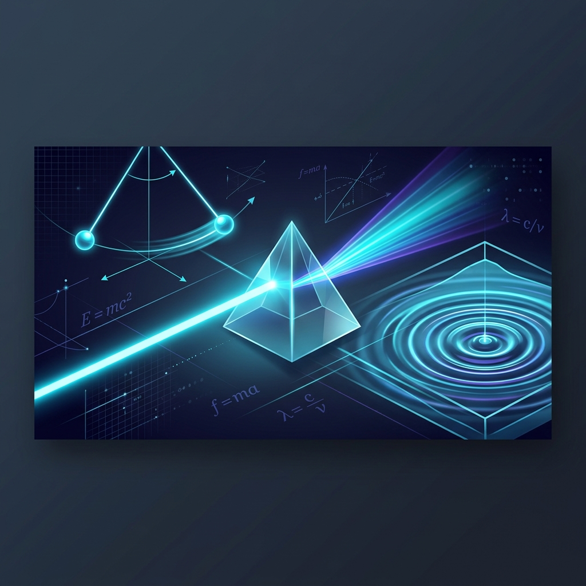

# Interactive Physics & Engineering Simulations

[](https://opensource.org/licenses/MIT)
[](https://rrmudry.github.io)
[](https://github.com/rrmudry/rrmudry.github.io/commits/main)



## 🎯 Project Vision

Bringing abstract physics concepts to life through immersive, interactive, and high-performance WebGL and Canvas simulations. This repository serves as a living laboratory for student exploration and conceptual mastery.

> [!TIP]
> All simulations are designed to run directly in the browser—no plugins or installation required. Perfect for Chromebooks and student hardware.

## 🚀 Featured Simulations

### 🌊 Waves & Optics
| Simulation | Description | Link |
| :--- | :--- | :--- |
| **3D Refraction Lab** | High-precision 3D optical simulation with virtual ray tracing. | [Run Lab 🔬](Unit_6_Waves_Radiation/refraction_lab/index.html) |
| **Ripple Tank** | Advanced wave interference, diffraction, and reflection modeling. | [Run Lab 🔬](Unit_6_Waves_Radiation/ripple_tank/index.html) |
| **Signal Analyzer** | Real-time frequency analysis and digital encoding tools. | [Run Lab 🔬](Unit_6_Waves_Radiation/signal_analyzer/index.html) |
| **Pendulum Mastery** | Interactive period testing with physics-based data validation. | [Run Lab 🔬](Unit_6_Waves_Radiation/pendulum_lab/index.html) |

### ⚙️ Mechanics & Motion
| Simulation | Description | Link |
| :--- | :--- | :--- |
| **2D Momentum Lab** | Vector-based collision dynamics with customized mass/velocity. | [Run Lab 🔬](physics-2d-momentum-lab/index.html) |
| **Rocket Cart** | Newton's Second Law investigation with variable friction and thrust. | [Run Lab 🔬](rocket-cart-lab/index.html) |
| **Velocity Vectors** | Hands-on vector addition and component decomposition. | [Run Lab 🔬](velocity_vectors_interactive/index.html) |
| **Pulley Work** | Study mechanical advantage and work-energy theorem. | [Run Lab 🔬](pulley-work/index.html) |
| **Cannon Duel** | Projectile motion simulation with air resistance and elevation. | [Run Lab 🔬](Cannon_duel/index.html) |

### ☀️ Astronomy & Thermodynamics
| Simulation | Description | Link |
| :--- | :--- | :--- |
| **Solar Structure** | Multi-layer exploration of stellar fusion and structure. | [Run Lab 🔬](Solar_Structure_Sim/index.html) |
| **Entropy Explorer** | Visualizing heat transfer and the cost of energy production. | [Run Lab 🔬](Entropy_Simulation/index.html) |
| **Inverse Square Law** | Radiation intensity and distance relationship visualizer. | [Run Lab 🔬](Inverse_Square_Law/index.html) |

## 🛠️ Built With

- **Three.js** - Immersive 3D rendering for complex optical paths.
- **Chart.js** - Real-time data visualization and trend analysis.
- **HTML5 Canvas** - Low-level physics-based rendering.
- **Vanilla JavaScript** - High-performance calculations without external overhead.

## 📂 Local Development

To explore these simulations locally:

1.  **Clone the Repository**
    ```bash
    git clone https://github.com/rrmudry/rrmudry.github.io.git
    cd rrmudry.github.io
    ```
2.  **Start a Local Server**
    You can use any light-weight server. For example, using Python:
    ```bash
    python3 -m http.server 8000
    ```
3.  **Explore**
    Visit `http://localhost:8000` in your browser.

## 📈 Integration & Pedagogy

These tools are built to support **AVID standards** and **Bilingual education**. Many labs include automated data checks to help students identify anomalous measurements and master the scientific process.

---
[Visit the Live Dashboard](https://rrmudry.github.io)
